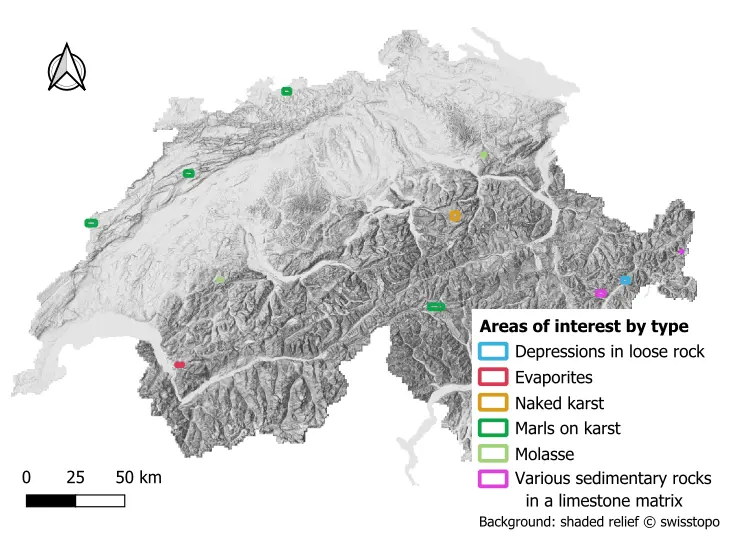

# Sinkhole mapping in Switzerland using automatic detection methods

This repository aims to detect sinkholes, also called dolines, based on the digital elevation model (DEM) of Switzerland.

Several methods were tested, they are presented here with some evaluation metrics. The full documentation is available on the [STDL tech website](https://www.stdl.ch/).

**Table of content**

- [Setup](#setup)
- [Data](#data)
- [Metrics](#metrics)
- [Methods](#methods)
    - [IGN](#ign)
    - [Watersheds](#watersheds)
    - [Level-set](#level-set)
    - [Stochastic depressions](#stochastic-depressions)
- [References](#references)

## Setup

Tested on Windows 10 with Python 3.11. No specific hardware requirement was identified.

Create a conda environment and then, install the `lidar` package with conda as indicated below. After this first step, the other packages can be installed with the requirement file.

```
conda create -n <env name> python=3.11
conda activate <env name>
conda install -c conda-forge mamba
mamba install -c conda-forge lidar
pip install -r requirements.txt
```

If you encounter difficulties with the `lidar` package, please refer to the [official documentation](https://lidar.gishub.org/installation/).

## Data

### Area of interest

Eleven areas of interest were selected by a geologist to test the methods. The areas of interest are provided in the `data` folder.



The lithological type of each area is indicated in the attributes.

### DEM

All the methods were tested and optimized with the Swiss DEM, [swissALTI3D](https://www.swisstopo.admin.ch/en/height-model-swissalti3d). The tiles necessary to cover the areas of interest were downloaded and merged with the following command:

```
python scripts/download_tiles.py config/<config file>
python scripts/merge_dem_over_aoi.py <config file>
```

A buffer around the area of interest was applied to avoid edge effects. The buffer size, and therefore the number of downloaded tiles, depends on the chosen method. Hence, these scripts are to be run for each method. 

### Vector layers

Two sinkhole datasets were used to evaluate the results:
* a ground truth;
    * established by an expert;
    * used to optimize the parameters of the methods;
    * precise but not complete;
    * provided in the `data` folder.

Several other layers were used to define possible sinkhole areas and limit false positive detections:
* the [settlement areas](https://www.geocat.ch/geonetwork/srv/eng/catalog.search#/metadata/4229c353-e780-42d8-9f8c-298c83920a3a);
* the [rivers](https://www.geocat.ch/datahub/dataset/50a848cc-fe89-426a-940b-cc409cb4ff50);
* the stagnant water from the land cover in the [swissTLM3D](https://www.swisstopo.admin.ch/en/landscape-model-swisstlm3d).

## Metrics

The following metrics were used to assess the results:

* precision: part of the detections that are correct;
* recall: part of the reference data that is detected;
* F2 score: weighted harmonic mean between the precision and the recall giving more importance to the recall.

The F2 score was used to optimize the parameters of all methods.

## Methods

**Parameters**

The chosen lithological type must be specified in the script `global_parameters.py`. Only the areas of interest with the corresponding type will be processed. `None` means that all the areas are processed at once with the same parameters. <br>
The parameters are automatically adjusted to the lithological type. They are saved for each type and method in the script `global_parameters.py` and imported in the workflow when needed. Only when the all the areas and the areas of marls on karst are processed with the stochastic method, the parameters are read from the config file.

The configuration files are used mostly to indicate input and output paths for each script.

**Assessment**

The results are compared to the ground truth and metrics are outputted with the command:

```
python scripts/assess_results.py config/<config file>
```

For each method, the metrics are given for the lithological type for which it was the best method based on the F2 score.

### IGN method


This method was used by the French Institute for Geographic and Forestry Information (IGN) to generalize generation of the contour lines in karstic plateaus for topographic maps. It is described in Touya et al. (2019). The second step of the procedure, which is presented above with an image from the original publication, consists of delimiting the plateau zones and detecting the sinkholes within them.

We adapted the original code into the following scripts:
* `determine_slope.py`: determine the slope of the DEM;
* `define_possible_areas.py`: define the sinkhole areas based on slope, settlement areas, rivers and stagnant waters;
* `doline_detection.py`: detect the sinkholes in the sinkhole areas.

The workflow is run with the following commands:

```
python scripts/ign/determine_slope.py config/config_ign.yaml
python scripts/ign/define_possible_areas.py config/config_ign.yaml
python scripts/ign/doline_detection.py config/config_ign.yaml
```

A bash script can be used to run the full workflow from tile download to assessment:

```
scripts/ign/ign_process.sh
```

To determine the best parameters for the Swiss topography, the algorithm is optimized with the following command:

```
python scripts/ign/optimization_ign.py config/config_ign.yaml
```

After the optimization, this method was the best one for the area of depressions in loose rock and evaporites. The following metrics were obtained on the ground truth:

_Table 1: metrics for each type of lithology for which the IGN's method was the best method._

| **Lithological type** | **precision** | **recall** | **F2 score**           |
|--------------------|:------------:|:--------------:|:-------------------:|
| Depressions in loose rock         |       0.75       |         0.62       |         0.64            |
| Evaporites              |          0.52    |       0.94         |         0.81            |


### Watershed method


The detection of sinkholes through the zonal fill of watersheds was first proposed by Obu & Podobnikar (2013). We use here the version with pre-processed DEM as presented by Telbisz et al. (2016) and used by Čonč et al. (2022). The workflow is illustrated above with an image from Telbisz et al. (2016).

The depression detection is run with the command below. [Post-processing](#post-processing) is performed to limit the number of false positives.

```
python scripts/watersheds/depression_detection.py config/config_watersheds.yaml
```

A bash script can be used to run the full workflow from tile download to assessment:

```
scripts/watersheds/watersheds_process.sh
```

To determine the best parameters for the Swiss topography, the algorithm is optimized with the following command:

```
python scripts/ign/optimization_watersheds.py config/config_watersheds.yaml
```

After the optimization, this method was the best one for the area of marl on karst, molasse and various sedimentary rocks in a limestone matrix (VSRLM). The following metrics were obtained on the ground truth after post-processing:

_Table 2: metrics for each type of geology for which the watershed method was the best method._

| **Area type** | **precision** | **recall** | **F2 score**           |
|--------------------|:------------:|:--------------:|:-------------------:|
| Marl on karst         |      0.39        |       0.47         |          0.45           |
| Molasse              |       0.44       |         0.76       |           0.66          |
| VSRLM              |         0.35     |        0.55        |            0.50         |

### Level-set method


The level-set method leverages the `lidar` package, a python package for delineation of nested surface depressions. The image above illustrates the detection of depressions with the level-set method. Once the tree graph of compound depressions is established, we only keep the depressions of level one or two based on their area.

The depression detection and tree graph processing are run with the command below. [Post-processing](#post-processing) is performed to limit the number of false positives.

```
python scripts/lidar_processing_libraries/level_set_depressions.py config/config_level-set.yaml
```

A bash script can be used to run the full workflow from tile download to assessment:

```
scripts/lidar_processing_libraries/level_set_process.sh
```

To determine the best parameters for the Swiss topography, the algorithm is optimized with the following command:

``` 
python scripts/lidar_processing_libraries/optimization_level-set.py config/config_level-set.yaml
```

After the optimization, this method was the best one for the area of naked karst. The following metrics were obtained on the ground truth after post-processing:

_Table 3: metrics for each type of geology for which the watershed method was the best method._

| **Area type** | **precision** | **recall** | **F2 score**           |
|--------------------|:------------:|:--------------:|:-------------------:|
| Naked karst         |      0.08        |        0.72        |        0.27             |

### Stochastic method

The package WhiteboxTools (WBT) has a function called [StochasticDepressionAnalysis](https://www.whiteboxgeo.com/manual/wbt_book/available_tools/hydrological_analysis.html#StochasticDepressionAnalysis). It performs a stochastic analysis of depressions within a DEM, calculating the probability of each cell of belonging to a depression. A probability threshold is then applied to delineate depressions.

The depression detection is run with the command below. [Post-processing](#post-processing) is performed to limit the number of false positives.

```
python scripts/lidar_processing_libraries/wbt_stochastic_depressions.py config/config_stochastic_deps.yaml
```

A bash script can be used to run the full workflow from tile download to assessment:

```
scripts/lidar_processing_libraries/stochastic_process.sh
```

To determine the best parameters for the Swiss topography, the algorithm is optimized with the following command:

```
python scripts/lidar_processing_libraries/optimization_stochastic_deps.py config/config_stochastic_deps.yaml
```

This method was the best one for none of the geological types.

### Post-processing

In all workflows except the IGN one, the detected depressions are filtered in post-processing to separated sinkhole from other depressions. First, detections in settlement and non-sedimentary zones are removed directly in the specific workflows. The remaining detections are filtered in `post-processing.py` based on percentage of area in a lake or a river, compactness, area, diameter, standard deviation of elevation, and depth. 

```
python scripts/watersheds/post_processing.py config/<config file>
```

## References

Čonč, Špela, Teresa Oliveira, Ruben Portas, Rok Černe, Mateja Breg Valjavec, and Miha Krofel. ‘Dolines and Cats: Remote Detection of Karst Depressions and Their Application to Study Wild Felid Ecology’. Remote Sensing 14, no. 3 (29 January 2022): 656. https://doi.org/10.3390/rs14030656.

Obu, Jaroslav, and Tomaž Podobnikar. ‘ALGORITEM ZA PREPOZNAVANJE KRAŠKIH KOTANJ NA PODLAGI DIGITALNEGA MODELA RELIEFA = Algorithm for Karst Depression Recognition Using Digital Terrain Model’. Geodetski Vestnik 57, no. 2 (2013): 260–70.

Telbisz, Tamás, Tamás Látos, Márton Deák, Balázs Székely, Zsófia Koma, and Tibor Standovár. ‘The Advantage of Lidar Digital Terrain Models in Doline Morphometry Compared to Topographic Map Based Datasets – Aggtelek Karst (Hungary) as an Example’. Acta Carsologica 45, no. 1 (7 July 2016). https://doi.org/10.3986/ac.v45i1.4138.

Touya, Guillaume, Hugo Boulze, Anouk Schleich, and Hervé Quinquenel. ‘Contour Lines Generation in Karstic Plateaus for Topographic Maps’. Proceedings of the ICA 2 (10 July 2019): 1–8. https://doi.org/10.5194/ica-proc-2-133-2019.

Wu, Qiusheng. ‘Lidar: A Python Package for Delineating Nested Surface Depressions from Digital Elevation Data’. Journal of Open Source Software 6, no. 59 (2 March 2021): 2965. https://doi.org/10.21105/joss.02965.
